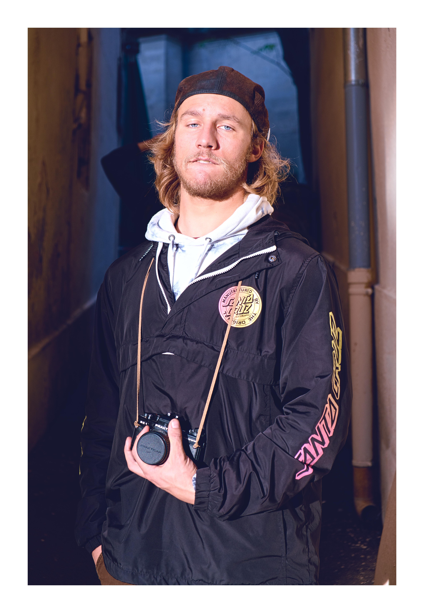

Image Frame
===========

Frame your images.
------------------

This program provides simple cli for framing jpeg and png images.

Commands
--------

-  `--help` , `-h`

   -  Show help.

-  `--input` , `-i`

   -  The input to process. If is dir, will process all the jpeg of png
      it finds.

-  `--output` , `-o`

   -  TODO

-  `--size` , `-size`

   -  Specify the size of the final image, if not specified, original
      size is kept and the program just add the frame, so it will be
      bigger.

-  `--frame-size` , `-fs`

   -  Specify the size of the frame, as precentage of the greater size
      of the image, default is 5.

-  `--frame-shape` , `-fsh`

   -  Specify the shape of the frame. **Values : same, square**.

-  `--frame-color` , `-fc`

   -  Specify the color of the frame. **Values : median or color** *(see
      -ac, --available_colors for all colors).* Default is white.

-  `--tag-exifs` , `-te`

   -  Tag the frame with exif tag at the given location if one location
      arg is specified. **Values : top, bottom**

-  `-d` , `--description`

   -  Tag the frame with given string at the given location if one
      location arg is specified. ocations : top, bottom. Take 2 args,
      exemple :
   -  `--description 'Cool description' bottom` .

-  `--font-size-weight` , `-ftw`

   -  Specify the multiplier for the font size. 1 is default.

-  `--font-color` , `-fco`

   -  Specify the color of the font. *(see -ac, --available_colors for
      all colors).

-  `--available-colors` , `-ac`

   -  Print all the available color options for `--frame_color` and
      `--font-color`, skip any other arg.

-  `@`

   -  A txt file containing a list of args. The args must be one by line
      :

      -  --size
      -  2048
      -  --frame-color
      -  purple
      -  ...

   -  Exemple : `@my_args.txt`

Exemples
--------

Here i have this image **my_image.jpeg** :

.. raw:: html

   

If i just process it without giving any args, i have this :

`py -m image_frame -i my_image.jpeg`

.. raw:: html

   

If i want to add a **square frame**, the **exifs at the top**, my
instagram **tag at the bottom** , and have an image of **size** 2048 \*
2048 :

`py -m image_frame -i my_image.jpeg --frame-shape square --tag-exifs top --description '@iammarcferrer' bottom --size 2048`

.. raw:: html

   

If you like colors it is also possible :
`py -m image_frame -i my_image.jpeg --frame-color gold --description 'blue' bottom --font-color green`

.. raw:: html

   

You can visit
`@iammarcferrer <https://www.instagram.com/iammarcferrer/>`__ on
instagram, where i use it all the time.
